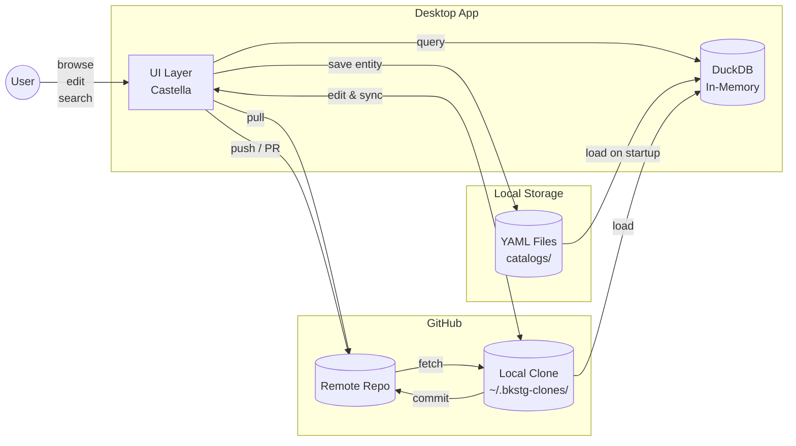

# bkstg - Mini IDP

> A serverless desktop Internal Developer Portal.
> Backstage-compatible, zero infrastructure required.

## Highlights

- **Zero Server** - Git repo + DuckDB (in-memory) = no backend needed
- **Backstage Compatible** - Use existing YAML catalogs as-is
- **Rich Visualization** - Dependency graphs, dashboards, heatmaps
- **GitHub Sync** - Bidirectional sync with Pull/Push/PR workflows

## Architecture



### Data Flow

1. **Startup**: YAML files → DuckDB (in-memory for fast queries)
2. **Browse/Search**: User → UI → DuckDB → UI → User
3. **Edit**: User → UI → YAML (local) or Clone (GitHub)
4. **GitHub Sync**: Pull (Remote → Clone → DuckDB) / Push (Clone → Remote)

## Demo

https://github.com/i2y/bkstg/raw/main/assets/demo.mp4

## Features

### Catalog Management

- 7 entity types: Component, API, Resource, System, Domain, User, Group
- Form-based editor for easy YAML editing
- Full-text search across all entities
- Location entities for multi-repository aggregation

### Dependency Graph

- Interactive visualization with pan/zoom
- Automatic cycle detection with warnings
- Click nodes to navigate between entities
- Visual relationship mapping (owns, depends on, provides API, etc.)

### Scorecard System (bkstg Extension)

bkstg extends Backstage with a powerful scorecard system:

- **Custom Scores**: Define metrics like security, documentation, testing
- **Rank Formulas**: Calculate ranks with customizable formulas
- **Threshold Labels**: S/A/B/C/D rankings based on score thresholds
- **History Tracking**: Track score and rank changes over time

```yaml
# Example: metadata.scores in entity YAML
metadata:
  name: my-component
  scores:
    - score_id: security
      value: 85
      reason: "Passed security audit"
```

### Dashboard

A comprehensive dashboard with multiple views:

| Tab | Description |
|-----|-------------|
| **Overview** | Entity counts, scored entities, average scores |
| **Charts** | Bar charts (by kind), Pie charts (rank distribution), Gauge (overall score) |
| **Heatmaps** | Kind × Score matrix, Entity × Score matrix with rank labels |
| **History** | Time-series graphs for scores and ranks, definition change tracking |
| **Leaderboard** | Top entities ranked by each metric |

### GitHub Sync

Bidirectional synchronization with GitHub repositories:

- Pull changes from remote repositories
- Push local changes with auto-commit
- Automatic conflict detection via dry-run merge
- Create PRs when conflicts occur
- Score and history data synchronized alongside entities

### Multi-Repository Support

- **Location entities** aggregate catalogs from multiple GitHub repos
- **Parallel fetching** for improved performance
- **Nested locations** support (Location → Location → entities)
- **Caching** with configurable TTL

## Quick Start

### Requirements

- Python 3.11+
- [uv](https://docs.astral.sh/uv/) (recommended) or pip
- `gh` CLI (for GitHub sync features)

### Installation

```bash
uv sync
```

Or with pip:

```bash
pip install -e .
```

### Usage

```bash
uv run bkstg [catalog-path]
```

If no path is provided, the current directory is used.

## Configuration

Create `bkstg.yaml` in your project root:

```yaml
sources:
  # Local catalog directory
  - name: local
    type: local
    path: catalogs
    enabled: true

  # GitHub repository with sync enabled
  - name: my-github-catalog
    type: github
    owner: myorg
    repo: software-catalog
    branch: main
    path: catalogs
    enabled: true
    sync_enabled: true    # Enable Pull/Push/PR
    auto_commit: true     # Auto-commit on save

settings:
  cache_ttl: 300          # Location cache TTL in seconds
  max_workers: 4          # Parallel fetch workers
```

## Catalog Structure

```
catalogs/
├── components/       # Service definitions
├── apis/             # API specifications
├── resources/        # Infrastructure resources
├── systems/          # System groupings
├── domains/          # Business domains
├── users/            # Team members
├── groups/           # Teams
├── locations/        # Multi-repo aggregation
├── scorecards/       # Score/rank definitions
└── history/          # Score/rank history
    ├── scores/
    ├── ranks/
    └── definitions/
```

## Entity Kinds

| Kind | Description |
|------|-------------|
| **Component** | Software units (services, libraries, websites) |
| **API** | Interface definitions (OpenAPI, GraphQL, gRPC) |
| **Resource** | Infrastructure (databases, caches, queues) |
| **System** | Groups of related components |
| **Domain** | Business domain contexts |
| **User** | Team members |
| **Group** | Teams and organizational units |
| **Location** | References to external catalogs |

## Tech Stack

| Component | Technology |
|-----------|------------|
| **UI Framework** | [Castella](https://github.com/aspect-codes/castella) (OpenGL/Skia-based reactive UI) |
| **Database** | DuckDB (in-memory SQL for fast queries) |
| **GitHub CLI** | `gh` (authentication and API operations) |
| **Schema** | Pydantic models with Backstage compatibility |

## License

MIT
